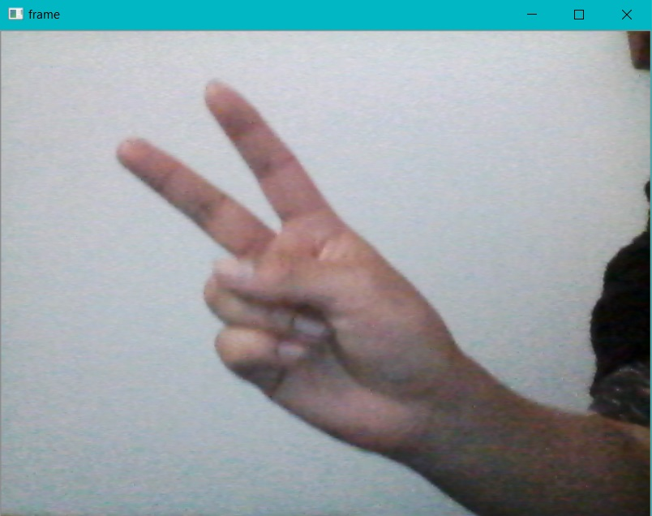
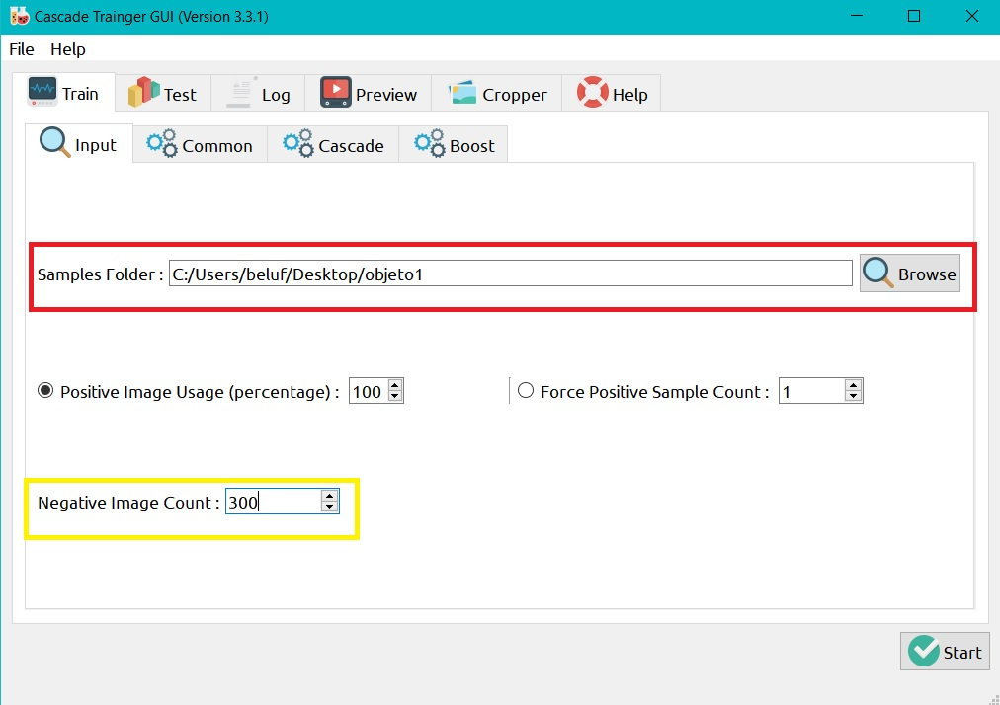
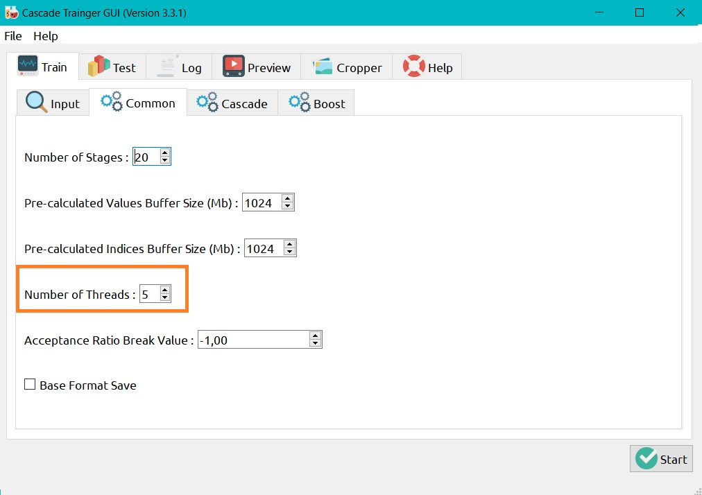
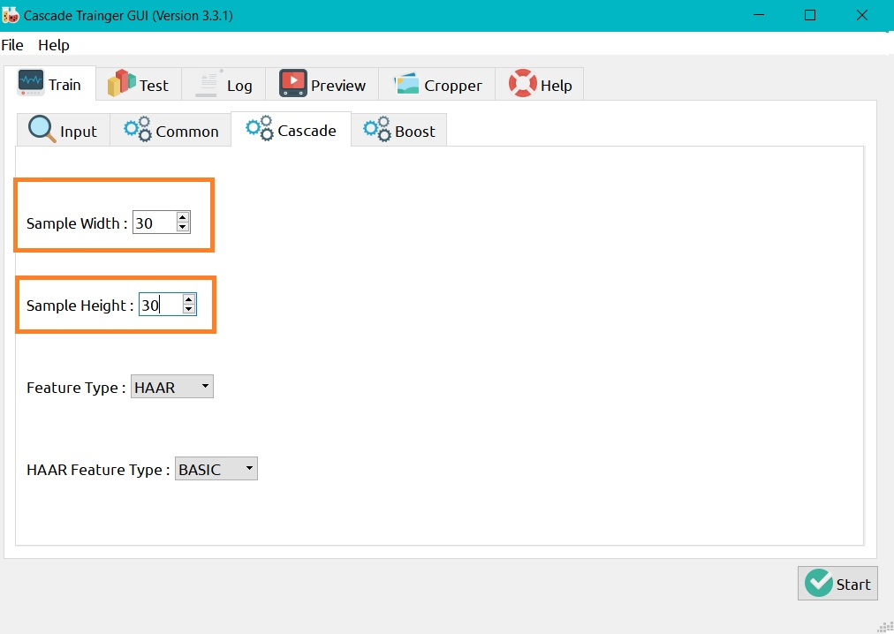
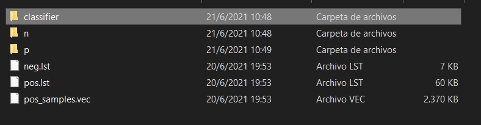
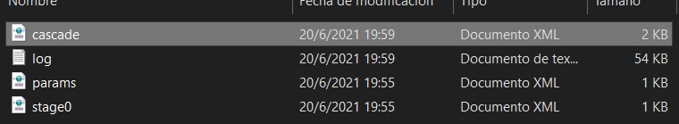

# ROCK-SCISSOR-PAPER
ROCK SCISSOR PAPER with python and haar cascade

## Guideline to Run The Game ROCK-SCISSOR-PAPER:

Step 1. Create a folder named RSP
Step 2. Download all the files and place them inside the RCP folder
Step 3. Finally run the .py file

## To use the cell phone camera
You can download the application of droit cam on your cell phone and your computer, and put them through a usb cable or that both are connected to a wifi network
DroidCam : https://www.dev47apps.com/droidcam/windows/

Then you must make the following modification in the .py file where usually the value of 0 refers to the default camera of laptops, the channel of the cell phone camera will be found in channel 2 or 3

## What about the .xml files?
These files are generated with the help of the Cascade-Trainer-GUI program.
You can get your own xml files
- First we create a folder with the name objeto1, inside it we create 2 folders, one called n in which the images will be found where the object to be detected is not found, and the other folder called p in which there are images of the object to be detected in different positions.
- In the search engine we locate the folder "object1", then we place the number of images found in the folder "n", for example, if you have 300 in the yellow box, write down that amount.

- In the common tab we can vary the number of threads to speed up the process

-In the Cascade tab we define the dimensions of the images in our folder "n", for example if the size of the images is 30x30 we enter:

-Finally we START and then within the same folder selected as "object1" the file of our importance will be generated within the "classifier" folder with the name of "cascade.xml"

